# OmniSeed

In-house data seed analyser: ingests fragmented data (IoT, wearables,
uploads), analyses it with a locally hosted LLM (LM Studio + Phi), and
stores only generated metadata/summaries long-term in a local SQLite
database.



See `PLAN.md` for the full architecture writeup.

## Layout

```
omniseed/
├── PLAN.md                    Full architecture & build plan
├── pyproject.toml              Python deps for collector + analyser (uv-managed)
├── collector/
│   ├── main.py                 FastAPI push endpoints (/ingest/*)
│   └── poller.py                Polling collectors for pull-based sources
├── analyser/
│   ├── prompts.py                Per-source-type prompt builders
│   └── worker.py                  Queue consumer, calls LM Studio, persists results
├── db/
│   └── schema.sql                  SQLite schema (jobs, analysis_results, sources)
└── ui/
    ├── server/
    │   ├── package.json
    │   ├── db.js                    SQLite connection (better-sqlite3)
    │   └── routes/export.js         Express CSV/JSON/PDF export route
    └── client/
        └── ExportPanel.jsx           React export controls
```

## Why SQLite + uv

- **SQLite** keeps the whole stack local with zero extra services to run —
  no Postgres server, no separate DB credentials. WAL mode lets the
  analyser worker (writer) and UI backend (reader) operate concurrently
  without locking issues at this scale. If you later need multi-writer
  concurrency or heavier query load, migrating to Postgres is
  straightforward since the schema/queries are simple.
- **uv** replaces pip + venv with a single fast tool — `uv run` creates and
  manages the virtual environment automatically based on `pyproject.toml`,
  no manual `venv` activation needed.

## Running locally (recommended)

Use the included shell script for a local runloop:

```bash
./run-locally.sh init
./run-locally.sh start
```

Commands:

- `./run-locally.sh init`
  - creates `omniseed.db` from `db/schema.sql` if needed
  - installs Python dependencies with `uv`
  - installs Node dependencies for `ui/server`
- `./run-locally.sh start`
  - starts the FastAPI collector API on `http://localhost:8000`
  - starts the collector poller
  - starts the analyser worker
  - starts `ui/server/server.js` if present
- `./run-locally.sh stop`
  - stops the managed background processes

Manual steps (if you prefer them):

1. Create the SQLite database from the schema:
   ```bash
   sqlite3 omniseed.db < db/schema.sql
   ```
2. Start Redis locally (still used as the job queue between collector and
   analyser — SQLite isn't a good fit for queue semantics).
3. Start LM Studio in server mode with a Phi model loaded (listens on
   `localhost:1234` by default).
4. Install Python deps and run the collector API:
   ```bash
   uv run uvicorn collector.main:app --reload --port 8000
   ```
5. Start the polling collectors:
   ```bash
   uv run python collector/poller.py
   ```
6. Start the analyser worker:
   ```bash
   uv run python analyser/worker.py
   ```
7. Install and start the Node UI server:
   ```bash
   cd ui/server && yarn install && node server.js
   ```
   (wire up your own `server.js`/Express app importing `routes/export.js`)
8. Start the React client, using `ExportPanel` in your results view.

By default, both the analyser worker and the UI server look for
`omniseed.db` in the working directory — set `OMNISEED_DB_PATH` as an
environment variable if you want it elsewhere.

## Notes

- All components are designed to run entirely on the local network — no
  external API calls for LLM inference or data storage.
- Raw payloads and uploaded files are deleted immediately after a job's
  summary is successfully persisted (see `analyser/worker.py:persist_and_cleanup`).
- This is a working skeleton, not a production-hardened system — auth,
  retry/backoff tuning, and monitoring are called out as next steps in
  `PLAN.md`.
